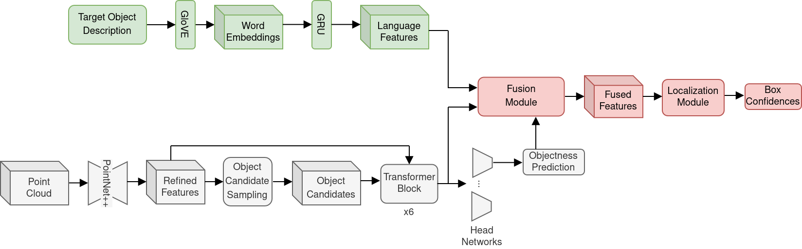

# RefNetV2

In this project, the ScanRefer baseline architecture is modified to take advantage of an improved object detection.
The overall aim is to improve the results for the visual grounding task. Our proposed architecture is depicted here:

For a detailed description of this project, please refer to the report and the presentations in the 
[`docs`](docs/) directory.

## Usage

### Training

The basic settings we used to train the models described in the [final report](docs/final_report.pdf)
are shown below (we used pre-trained detection modules as mentioned further below).

`L6`: Object detector with 6 transformer decoder blocks:

    python scripts/train.py --no_lang_cls --no_height --batch_size 10 --lr_scheduler plateau \
                            --augment --val_step 3000

`L12, wx2`: Object detector with 12 transformer decoder blocks and a double width backbone:

    python scripts/train.py --no_lang_cls --no_height --batch_size 5 --lr_scheduler plateau \
                            --augment --val_step 3000 --num_decoder_layers 12 --width 2
                            
For additional input features, select appropriate flags (and remove `--no_height` to include height values):

    --use_color --use_normal --use_multiview

To use the language classification proxy loss just remove the `--no_lang_cls` flag, and 
to use our proposed *multi-ref* loss or the VoteNet objectness just set the corresponding flag:

    --use_multi_ref_gt --use_votenet_objectness
    
#### Pre-trained detector

It is strongly advised to use a pre-trained weight initialization for the transformer-based object detector.
You can use the provided weights in 
[Group-Free 3D Object Detection via Transformers](https://github.com/zeliu98/Group-Free-3D#scannet-v2) via:

    --use_pretrained_transformer <path to model>
    
Or you can pre-train your own detection module with our code using the `--no_reference` flag. 
The detector will then be trained on the entire ScanNet training data for detection.
To use your own pre-trained detection module as weight initialization for visual grounding, set the flag:

    --use_pretrained_det <folder name in outputs>

### Visualization

Use the following arguments for the `visualize.py` script 
(+ all the arguments required to load the model, e.g. `--no_height` for models that don't use
the hight as input or `--num_decoder_layers 12` for the 12 layer detector):

    python scripts/visualize.py --folder <path to model> --scene_id <id from val set> 

### Evaluation of our models

Please contact bastian.wittmann@tum.de or philipp.foth@tum.de in order to receive pre-trained models.

`REFNETV2_6L_XYZ` - 6 transformer decoder blocks, input: XYZ-coordinates:

    python scripts/eval.py --folder <path to model> --reference --no_height --no_lang_cls \
                           --no_nms --force --repeat 5

`REFNETV2_6L_XYZ_H_N_RGB` - 6 transformer decoder blocks, input: XYZ-coordinates, height, normals, RGB:

    python scripts/eval.py --folder <path to model> --reference --use_color --use_normal \
                           --no_lang_cls --no_nms --force --repeat 5

`REFNETV2_6L_XYZ_H_N_M` - 6 transformer decoder blocks, input: XYZ-coordinates, height, normals, 
multiview features:

    python scripts/eval.py --folder <path to model> --reference --use_multiview --use_normal \
                           --no_lang_cls --no_nms --force --repeat 5

`REFNETV2_12L_W2_XYZ` - 12 transformer decoder blocks and double backbone with, input: XYZ-coordinates:

    python scripts/eval.py --folder <path to model> --reference --no_height --no_lang_cls \
                           --no_nms --force --repeat 5 --num_decoder_layers 12 --width 2

### Further information and arguments
    python scripts/train.py --help
    python scripts/eval.py --help
    python scripts/visualize.py --help

## Dataset

To setup and prepare the data, please refer to the 
[ScanRefer](https://github.com/daveredrum/ScanRefer#dataset) repository.

## References

The project and source code is based on the [ScanRefer](https://github.com/daveredrum/ScanRefer) and the 
[Group-Free-3D](https://github.com/zeliu98/Group-Free-3D) project.

    @article{chen2020scanrefer,
        title={ScanRefer: 3D Object Localization in RGB-D Scans using Natural Language},
        author={Chen, Dave Zhenyu and Chang, Angel X and Nie{\ss}ner, Matthias},
        journal={16th European Conference on Computer Vision (ECCV)},
        year={2020}
    }

    @inproceedings{dai2017scannet,
        title={Scannet: Richly-annotated 3d reconstructions of indoor scenes},
        author={Dai, Angela and Chang, Angel X and Savva, Manolis and Halber, Maciej and Funkhouser, Thomas and Nie{\ss}ner, Matthias},
        booktitle={Proceedings of the IEEE Conference on Computer Vision and Pattern Recognition},
        pages={5828--5839},
        year={2017}
    }

    @article{liu2021,
        title={Group-Free 3D Object Detection via Transformers},
        author={Liu, Ze and Zhang, Zheng and Cao, Yue and Hu, Han and Tong, Xin},
        journal={arXiv preprint arXiv:2104.00678},
        year={2021}
    }

